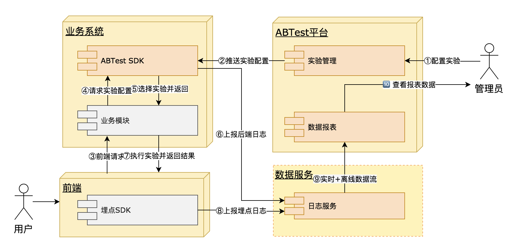
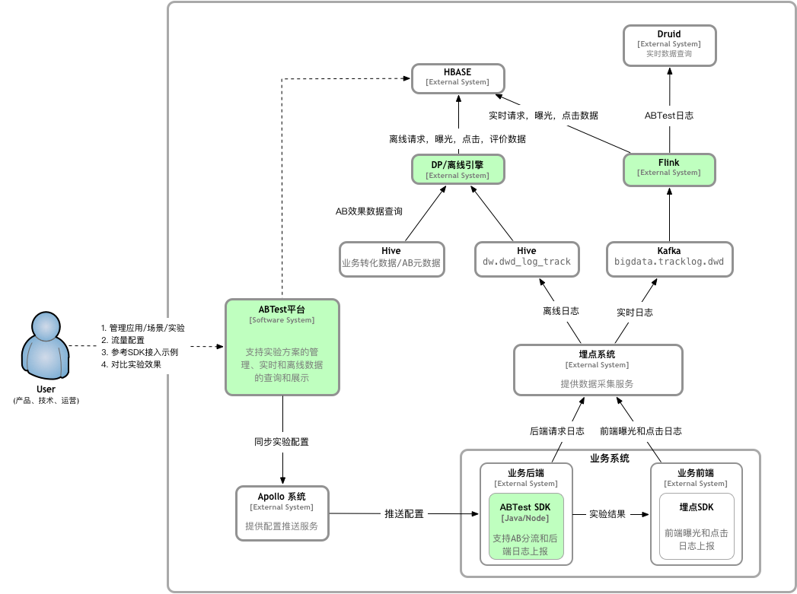

# ab test server
1. db.Datainit() is a mock of database

# how to run
1. go run main.go

# AB Test 设计概念说明
1. Zone: 域，属于某一个层，分流后的一个流量块，起始域为全流量。域属于某一层，同一层的不同域流量互斥，且同一层的所有域的流量总和等于进入该层的全部流量。域横向切割一个层，为该层进行AB test测试的“因素”一个实验场景。
2. Layer: 层，继承或者延伸某些域，数据流通的纵向的一个位置，在同一层中进行某一个“因素”的AB test实验。进入该层的流量来自于指定的“父域”。起始层的流量为全流量。
3. 通过“域”和“层”的组合和嵌套，可以对流量进行任意的切割和组合，实现多“因素”的组合AB test。如下图：


# AB Test 实验流程
1. PM 通过AB test server创建生成实验配置文件，并持久化。
2. 开发人员根据实验配置，通过abtest sdk实现业务的实验代码，并上线。（需要人为约定规范）
3. 用户流量进入实验，sdk会获取AB test server 的实验配置，并缓存本地，然后对用户ID等进行hash和取模运算，进行随机分流。业务服务同时进行数据采点。
4. PM 通过AB test server 进行实验数据的实时或离线观察
5. 实验结果选择出最优策略后，先通过AB test server将流量全部导入最优策略的分支
6. 开发人员删除abtest 代码，迭代上线   
如下图：



# hash 算法
1. 	流量分流的方式：
	- userID + layerID // userID是对用户随机分流，layerID是为了进入下一层后又随机分流
	- cookie(deviceID等) + layerID // userID可以使用其他的全局唯一ID，如 deviceID
	- userID + Date + layerID  // Date 是为了同同一个用户可以按时间进行重新流量分配，如Date等于日期的时候，同一个用户每天进行的实验是重新随机的
	- cookie(deviceID等) + Date + layerID

# 实验配置 本地缓存
1. sdk 通过一个线程轮询AB test server的实验配置，并缓存本地

# 数据采点
1. 实验在每一层都可以进行数据收集，并通过ctx传到下一层，并最终上传数据中心


# 参考链接
```
https://tech.youzan.com/abtest-for-growth/
``` 