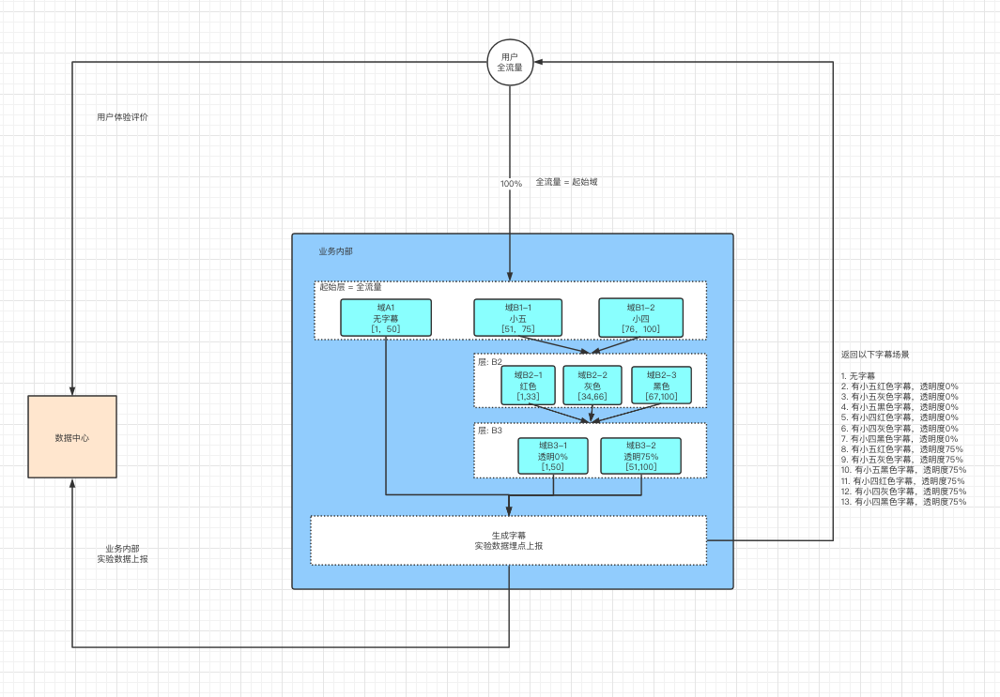

# AB Test 简介
AB测试是为Web或App界面或流程制作两个（A/B）或多个（A/B/n）版本，在同一时间维度，分别让组成成分相同（相似）的访客群组（目标人群）随机的访问这些版本，收集各群组的用户体验数据和业务数据，最后分析、评估出最好版本，正式采用。    

单个功能的 AB Test 是很容易做的，但与此带来的数据统计拆分，每次都会带来重复的工作量。因此比较节约的方式是，一次性设计好 AB test 功能架构，支持未来的持续 AB test，降低单次测试带来的边际成本。  

常见的两种 AB Test 设计方式：  
- 两套代码：AB两个版本的代码分别部署在不同的机器，通过统一的router分发流量。好处是对业务侵入性小，灰度发布和正式上线都非常方便。但要求就是开发流程是分支开发模式且代码部署需要和分流路由可用统一配置和联动。且部署成本高，扩展性差。
- 一套代码：业务逻辑中写好各个实验分支，通过在业务服务器里面嵌入AB测试框架的client，判断流量是该走哪个分支。这种思路的好处是对外部系统依赖小，全部逻辑都在业务服务。缺点是对业务的侵入性大，代码维护还有整洁度下降。  

基于我们的现状，采用“一套代码”方案。  

# AB Test 实验流程与架构
1. PM 通过AB test server创建生成实验配置文件。 
2. 开发人员根据实验配置，通过abtest sdk实现业务分支控制，并上线。（需要人为约定规范，开发需要能理解实验配置，因此建议实验设计是开发和PM一起制定） 
3. 用户流量进入业务，sdk会获取AB test server 的实验配置，并缓存本地，然后进行hash和取模运算，进行随机分流，使用户进入不同的实验。前端预留用户体验评价的入口，后台业务服务同时进行数据采点。  
4. PM 通过AB test server 进行实验数据的实时或离线观察  
5. 实验结果选择出最优策略后，先通过AB test server将流量全部导入最优策略的分支  
6. 开发人员删除abtest 代码，迭代上线   
如下图：


# 注意
目前只支持golang sdk  

# AB Test SDK 中相关概念说明
1. Project: 一个完整的 AB Test实验，对应着 AB test server 数据库的一个完整的实验配置。不同的 Project 相互独立。PM 通过 AB test server 定义一个 Project, 并设计完整的实验配置。开发通过 sdk 同步指定的 Project 实验配置，并实现实验业务逻辑。在一个 Project 内部通过 Zone 和 Layer 的切割与组合，实现对流量的细分。
1. Zone: 域，属于某一个层，同一层的不同域流量互斥，且同一层的所有域的流量总和等于进入该层的全部流量。域横向切割一个层的流量，为该层测试“因素”的实验场景之一。
2. Layer: 层，流量来自一个或者多个域，这些域被称为“父域”。在同一层中进行一个“因素”的 AB test 实验。不同层的流量正交，可以进行“多因素”的组合对比测试。流量在层中随机分配，因此同一个“父域”只能指向一个“下层”，无法同时指向两个不同的“下层”。 同时，“父域”的流量只能指向“层”，无法指定到“下层的域”，因为，进入“层”的流量会再次随机分配。 
3. 起始域为全流量
4. 起始层，流量来自于起始域，为全流量
5. 通过同一层域的切割，与不同层的正交，可以进行多个因素任意的组合对比测试。如下图，为 Project: Subtitle 的实验设计。其中：
	- 起始域为用户全流量。起始域的流量进入业务内部后，首先进入实验的起始层。
	- 起始层分为三个域：A1/B1-1/B1-2。进入起始层的流量会根据权重随机分配给这三个域。
	- 进入A1域后没有下一层，实验结束。返回“无字幕”场景，并上报实验数据。
	- 进入B1-1/B1-2域的流量都被指向了下一层B2层。
	- B2层分为B2-1/B2-2/B2-3三个域，进入B2层的流量再次根据权重随机分配给这三个域。
	- 进入B2-1/B2-2/B2-3域的流量都指向了下一层B3层。
	- B3层分为B3-1/B3-2三个域, 进入B3层的流量再次根据权重随机分配给这连个域。
	- B3层之后实验结束，返回不同“字体大小”、“字体颜色”、“字体透明度”组合的字幕实验场景，并上报数据。


# AB Test SDK 中 实验配置 本地缓存
1. sdk 通过一个线程轮询AB test server的实验配置，并缓存本地。可以通过 sdk 指定的实验Project和设置同步周期。因此在进程的初始化阶段需要调用以下方法进行设置。
```
sdk.SetCacheSyncDBFrequency([]string{"Home", "Color", "ComplexColor", "Theme"}, time.Second*60)
```

# AB Test SDK 中 hash 算法
1. 	流量分流的方式：
	- hash 算法根据传入的 haskkey 作 hash取模运算来实现随机分流
	- 为保证同一个用户进入的实验始终是唯一，使得用户不会在 AB 实验中反复横跳。因此hashkey 通常使用 userID/deviceID 等唯一性的ID 保证 hash 取值的唯一性
	- 某些与时间相关的场景，比如为了实现用户每天进行的 AB 实验都是随机的，可以 对 userID + date(日期) 进行hash,使得用户每天进入的 AB 实验都是随机的。
	- 同时，在多层实验设计中，进入下一层的流量应该再次随机分配，因此应该对 userID + layerID 进行hash, 使得流量进入每层之后又再次随机分流。在本框架设计中，每层的流量都会再次随机分配，因此layerID 是求 hash 值的必传参数  
    - 其中 userID/deviceID/date 等在某些场景中需要拼接成hashkey透传下去，然后每层根据透传的hashkey 和当前的 layerID 进行hash.举例： AB 实验需要对所有的用户进行 AB test， 代码可以设计为：
	```
	// 调用实验, 使用 userID 作为 hashkey, 透传下去
	Layer1(ctx, userID)
	...省略...
	func Layer1(ctx context.Context, hashkey string) {
		...
		// 根据 hashkey 、 layerID 分流
		targetZone := sdk.GetABTZone(project, hashkey, layerID) 
		...
	}
	...省略...
	```

# AB Test SDK 中 对流量的来源进行校验，确保实验流量的准确性	
  在本 AB test 框架中，会对进入每一层的流量进行“父域校验”，即校验该流量是否是来自于“父域”。  
  如果流量不是来自于“父域”，则返回“空值”，因此业务开发必须要对实验增加默认分支，进行兜底。  
  “父域校验”的作用是，可以排除因为代码bug等原因导致错误的流量进入实验，影响实验结果的准确性。   
  起始层的“父域”是全流量，因此不需要校验。  
 

# AB Test SDK 中 数据采点
1. 实验数据可以在每一层中上报。
```
... 省略上下文 ...
// 调用实验
Layer1(ctx, userID)
... 省略上下文 ...
func Layer1(ctx context.Context, hashkey string) {
		...
		// 定义输出0
		labOutput := &sdk.LabOutput{
			ProjectID: Lab,
			UserID:    strconv.Itoa(userID),
			Time:      time.Now(),
			Data:      make(map[string]interface{}), 
			LabPath:   make([]string, 0),           
		}		
		// 上报实验数据
		labOutput.Data["停留时间"] = 60
		sdk.PushLabOutPut(labOutput) 
		// 调用 layer2
		Layer2(ctx, hashkey)
		...
}
func Layer2(ctx context.Context, hashkey string) {
		...
		// 定义输出0
		labOutput := &sdk.LabOutput{
			ProjectID: Lab,
			UserID:    strconv.Itoa(userID),
			Time:      time.Now(),
			Data:      make(map[string]interface{}), 
			LabPath:   make([]string, 0),           
		}		
		// 上报实验数据
		labOutput.Data["点击次数"] = 100
		sdk.PushLabOutPut(labOutput) 
		...
}
... 省略上下文 ...
```
2. 实验也可以在每一层都可以进行数据收集，并通过ctx传到下一层，并最终在收口处统一上传数据中心
```
... 省略上下文 ...
// 定义输出0
labOutput := &sdk.LabOutput{
	ProjectID: Lab,
	UserID:    strconv.Itoa(userID),
	Time:      time.Now(),
	Data:      make(map[string]interface{}), 
	LabPath:   make([]string, 0),           
}
ctx := context.WithValue(context.Background(), sdk.CTXKey("output"), labOutput)
// 调用实验
Layer1(ctx, userID)
... 省略上下文 ...
func Layer1(ctx context.Context, hashkey string) {
		...
		// 收集实验数据，通过ctx透传下去，调用 layer2
		labOutput := ctx.Value(sdk.CTXKey("output")).(*sdk.LabOutput)
		labOutput.Data["停留时间"] = 60
		Layer2(ctx, hashkey)
		...
}
func Layer2(ctx context.Context, hashkey string) {
		...
		// 通过 ctx透传实验数据，在最后统一上报
		labOutput := ctx.Value(sdk.CTXKey("output")).(*sdk.LabOutput)
		labOutput.Data["点击次数"] = 100
		sdk.PushLabOutPut(labOutput) 
		...
}
... 省略上下文 ...
```

# sdk 的方法说明
1. func SetCacheSyncDBFrequency(projects []string, duration time.Duration) {...}
	- 作用：设置异步同步 AB test server 实验配置线程的指定实验和同步间隔
	- 原理：单独的一个线程异步同步server端的实验配置
	- 参数projects: 指定需要同步的实验project
	- 参数duration: 同步轮询的间隔   
使用举例：
```
sdk.SetCacheSyncDBFrequency([]string{"Home", "Color", "ComplexColor", "Theme"}, time.Second*60)
```

2. func GetABTZone(projectID, hashkey, layerID string) *Zone {...}  
	- 作用：匹配实验
	- 原理：根据传入的 hashkey + layerID 作hash取模运算，根据指定的project的实验配置，进行匹配，返回匹配的域。
	- 参数projectID: 指定实验
	- 参数hashkey: 根据 hashkey + layerID 进行 hash取模运算，实现随机分流
	- 参数layerID: 当前所在实验层的ID
	- 返回值*Zone: 即根据运算后随机匹配的实验场景  
使用举例：
```
	targetZone := sdk.GetABTZone(project, hashkey, layerID)
	switch targetZone.Value {
	case "A":
		...
	case "B":
		...
	default:
		...
	}
```

3. func PushLabOutPut(data *LabOutput) {...}
	- 作用：上传实验数据
	- 其他：因为实验数据的存储格式待定，所以该方法可能变动，因此不作过多说明

3. func GetLabOutput(projectID, path, tag string) []*LabOutput {...}
	- 作用：根据查询条件查询和统计实验数据
	- 其他：因为实验数据的存储格式待定，所以该方法可能变动，因此不作过多说明


# 单一因素AB test设计 
举例: APP 新主页首页AB Test 设计.  
1. PM通过AB test server 生成实验配置，并将需求告知开发，实验配置构思如下：
   
2. 开发人员开发实验业务代码，在返回首页的代码增加实验分支逻辑，通过sdk 对流量分流，代码结构如下：
```
...省略上下文,进入返回主页的代码逻辑...
// 根据hashkey(globalID、date等)和layerID, 获取随机分流的域. 前提是需要开发通过实验配置能理解知道当前的实验所在层的层ID。
targetZone := sdk.GetABTZone(hashkey, layerID)
// targetZone.Value 是sdk根据实验配置返回的一个符号标志，用于实验匹配，可以自定义
switch targetZone.Value {
case "A":
	// 数据采点，记录用户使用“原页面”。数据采点也可以在一个公共收口出统一上报，这样更合理。
	sdk.PushLabOutPut(labOutput)
	return setHome("原主页")
case "B" :
	sdk.PushLabOutPut(labOutput)
	return setHome("新主页")
case "C":
	sdk.PushLabOutPut(labOutput)
	return setHome("原主页")
case "D":
	sdk.PushLabOutPut(labOutput)
	return setHome("原主页")
// default 分支必须要有，保证业务正常
default:
	return setHome("原主页")
}
...省略上下文...
```
3. 代码部署上线，PM 通过 实时或者离线数据对实验结果进行统计分析，得出结论：
- C:D结果相对稳定
- B:CD结果，B更好
- 得出结论：新主页更好
4. PM修改实验配置，将流量全部导入B,使用新主页
5. 开发删除实验代码，并使用“新主页”，迭代上线
6. PM删除或者修改实验配置，停止实验或者接着进行别的实验

# 两个因素AB test设计
举例: 页面字体颜色与背景色 AB test 设计.  
1. PM通过AB test server 生成实验配置，并将需求告知开发，实验配置构思如下：
    
2. 开发人员开发实验业务代码，在返回首页的代码增加实验分支逻辑，通过sdk 对流量分流，代码结构如下：
```
...省略上下文进入设置字体颜色...
targetZone := sdk.GetABTZone(hashkey, "layer1 ID")
switch targetZone.Value {
case "A":
	sdk.PushLabOutPut(labOutput)
	return setColor("字体 黑色")
case "B" :
	sdk.PushLabOutPut(labOutput)
	return setColor("字体 红色")
case "C":
	sdk.PushLabOutPut(labOutput)
	return setColor("字体 白色")
default:
	return setColor("默认字体颜色")
}
...省略中间代码进入设置背景颜色...
targetZone := sdk.GetABTZone(hashkey, "layer2 ID")
switch targetZone.Value {
case "E":
	sdk.PushLabOutPut(labOutput)
	return setColor("背景 黄色")
case "D" :
	sdk.PushLabOutPut(labOutput)
	return setColor("背景 绿色")
default:
	return setColor("默认字体颜色")
}
...省略上下文...
```
3. 代码部署上线，PM 通过 实时或者离线数据对实验结果进行统计分析，得出结论：
- 得出结论：黑字蓝景更好
4. PM修改实验配置，将流量全部导入AE策略,
5. 开发删除实验代码，并使用“AD”策略，迭代上线
6. PM删除或者修改实验配置，停止实验或者接着进行别的实验 

特殊场景：如果背景色只有“黑色”和“白色”，而字体与背景不能同颜色，否则功能异常.   
所以流量分为 4 种组合：AD、BD、BE、CE.分别对比四种种组合的实验结果，选取最优组合策略.    
       
这种实验场景暂时不支持，因为进入每一层的流量之后是又随机分配的，因此上一层的域无法指定到下一层的域级别，只能指定到下一层，然后再被随机分流。因此域只能指定一个下一层。         

但是可以将上述需求设计成如下所示：  
     
同时需要开发在业务里面实现上述逻辑，示例如下：   
```

...省略上下文进入设置字体颜色...
func Layer1(...) {
targetZone := sdk.GetABTZone(hashkey, "Layer1 ID")
	switch targetZone.Value {
	case "A":
		setColor("字体 黑色")
		return Layer2-1(...)
	case "B" :
		setColor("字体 红色")
		return Layer2-2(...)
	case "B" :
		setColor("字体 白色")
		return Layer2-3(...)
	default:
		setColor("字体 默认颜色")
		return setBKColor("背景 默认颜色")
	}
}

func Layer2-1(...) {
targetZone := sdk.GetABTZone(hashkey, "Layer2-1 ID")
	switch targetZone.Value {
	case "D":
		return setBKColor("背景 白色")
	default:
		return setBKColor("背景 默认颜色")
	}
}

func Layer2-2(...) {
targetZone := sdk.GetABTZone(hashkey, "Layer2-2 ID")
	switch targetZone.Value {
	case "D":
		return setBKColor("背景 白色")
	case "E" :
		return setColor("字体 黑色")
	default:
		return setBKColor("背景 默认颜色")
	}
}

func Layer2-3(...) {
targetZone := sdk.GetABTZone(hashkey, "Layer2-3 ID")
	switch targetZone.Value {
	case "E" :
		return setColor("字体 黑色")
	default:
		return setBKColor("背景 默认颜色")
	}
}
...省略上下文...
```

# 跨进程 AB test 设计
举例: 显示主题 AB Test 设计.  
1. PM通过AB test server 生成实验配置，并将需求告知开发，实验配置构思如下：
   
2. 数据上报可以在最后统一上报，因此需要在远程调用时通过ctx将数据传递下去。也可以在每个进程单独上报，这样就不需要通过ctx传递数据，尤其是上报的数据较大时。
3. 其他类似。

# 具体使用实例参考 sdk 的example
- lab_home.go : 单一因素实验
- lab_color1.go : 两个因素组合实验
- lab_color2.go : 复杂的两个因素组合实验
- lab_rpc.go : 跨进程实验

# ab test server demo 说明
1. db.Datainit() is a mock of database

# how to run
1. go run main.go

# 性能设计
1. 本地缓存: 目前只有本地内存缓存, 缓解server端的压力。缓存通过单独的一个线程轮询server同步配置，有一定延迟，目前不作配置更新的推送。
2. 并发性能: 目前是单点服务，server仍然存在并发请求的瓶颈。


# 稳定性设计 
1. 网络超时问题，由于网络请求是在单独的线程进行，因此不会阻塞业务。
2. 单点故障问题，同上。但是sdk请求返回结果为空，因此业务必须增加默认策略分支，保证业务正常。

# 参考链接
```
https://tech.youzan.com/abtest-for-growth/
``` 