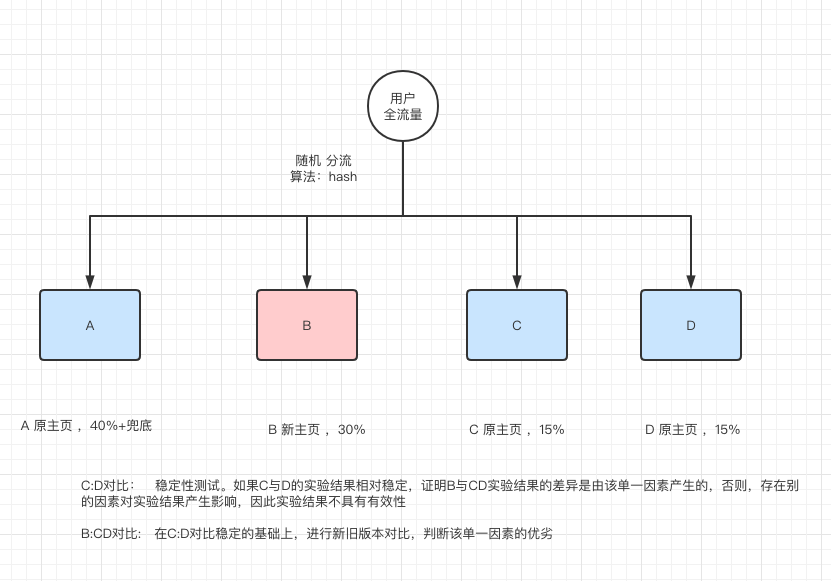

# AB Test 简介
AB测试是为Web或App界面或流程制作两个（A/B）或多个（A/B/n）版本，在同一时间维度，分别让组成成分相同（相似）的访客群组（目标人群）随机的访问这些版本，收集各群组的用户体验数据和业务数据，最后分析、评估出最好版本，正式采用。    

单个功能的 AB Test 是很容易做的，但与此带来的数据统计拆分，每次都会带来重复的工作量。因此比较节约的方式是，一次性设计好 AB test 功能架构，支持未来的持续 AB test，降低单次测试带来的边际成本。  

常见的两种 AB Test 设计方式：  
- 两套代码：AB两个版本的代码分别部署在不同的机器，通过统一的router分发流量。好处是对业务侵入性小，灰度发布和正式上线都非常方便。但要求就是开发流程是分支开发模式且代码部署需要和分流路由可用统一配置和联动。且部署成本高，扩展性差。
- 一套代码：业务逻辑中写好各个实验分支，通过在业务服务器里面嵌入AB测试框架的client，判断流量是该走哪个分支。这种思路的好处是对外部系统依赖小，全部逻辑都在业务服务。缺点是对业务的侵入性大，代码维护还有整洁度下降。  
给予我们的现状，采用“一套代码”方案。  

# AB Test 实验流程与架构
1. PM 通过AB test server创建生成实验配置文件。
2. 开发人员根据实验配置，通过abtest sdk实现业务分支控制，并上线。（需要人为约定规范，开发需要能理解实验配置，因此建议实验设计是开发和PM一起制定）
3. 用户流量进入实验，sdk会获取AB test server 的实验配置，并缓存本地，然后进行hash和取模运算，进行随机分流，使用户进入不同的体验。前端预留用户体验评价的入口，后台业务服务同时进行数据采点。
4. PM 通过AB test server 进行实验数据的实时或离线观察
5. 实验结果选择出最优策略后，先通过AB test server将流量全部导入最优策略的分支
6. 开发人员删除abtest 代码，迭代上线   
如下图：


# AB Test SDK 中相关概念说明
1. Zone: 域，属于某一个层，同一层的不同域流量互斥，且同一层的所有域的流量总和等于进入该层的全部流量。域横向切割一个层的流量，为该层测试“因素”的实验场景之一。
2. Layer: 层，流量来自一个或者多个域，这些域被称为“父域”。在同一层中进行一个“因素”的AB test实验。不同层的流量正交，可以进行“多因素”的组合对比测试。
3.起始域为全流量
4. 起始层，流量来自于起始域，为全流量
5. 同过同一层域的切割，与不同层的正交，可以进行多个因素任意的组合对比测试。如下图： 


# AB Test SDK 中 hash 算法
1. 	流量分流的方式：
	- userID + layerID // userID是对用户随机分流，layerID是为了进入下一层后又随机分流
	- cookie(deviceID等) + layerID // userID可以使用其他的全局唯一ID，如 deviceID
	- userID + Date + layerID  // Date 是为了同同一个用户可以按时间进行重新流量分配，如Date等于日期的时候，同一个用户每天进行的实验是重新随机的
	- cookie(deviceID等) + Date + layerID

# AB Test SDK 中 实验配置 本地缓存
1. sdk 通过一个线程轮询AB test server的实验配置，并缓存本地

# AB Test SDK 中 数据采点
1. 实验在每一层都可以进行数据收集，并通过ctx传到下一层，并最终上传数据中心

# 单一因素AB test设计 
举例: APP 新主页首页AB Test 设计.  
1. PM通过AB test server 生成实验配置，并将需求告知开发，实验配置构思如下：
  
2. 开发人员开发实验业务代码，在返回首页的代码增加实验分支逻辑，通过sdk 对流量分流，代码结构如下：
```
...省略上下文,进入返回主页的代码逻辑...
// 根据hashkey(globalID、date等)和layerID, 获取随机分流的域. 前提是需要开发通过实验配置能理解知道当前的实验所在层的层ID。
targetZone := sdk.GetABTZone(hashkey, layerID)
// targetZone.Value 是sdk根据实验配置返回的一个符号标志，用于实验匹配，可以自定义
switch targetZone.Value {
case "A":
	// 数据采点，记录用户使用“原页面”。数据采点也可以在一个公共收口出统一上报，这样更合理。
	pushLabData(...)
	return "原主页"
case "B" :
	pushLabData(...)
	return "新主页"
case "C":
	pushLabData(...)
	return "原主页"
case "D":
	pushLabData(...)
	return "原主页"
// default 分支必须要有，保证业务正常
default:
	return "原主页"
}
...省略上下文...
```
3. 代码部署上线，PM 通过 实时或者离线数据对实验结果进行统计分析，得出结论：
- C:D结果相对稳定
- B:CD结果，B更好
- 得出结论：新主页更好
4. PM修改实验配置，将流量全部导入B,使用新主页
5. 开发删除实验代码，并使用“新主页”，迭代上线
6. PM删除或者修改实验配置，停止实验或者接着进行别的实验

# 两个因素AB test设计
举例: 页面字体颜色与背景色 AB test 设计.  
1. PM通过AB test server 生成实验配置，并将需求告知开发，实验配置构思如下：
  
2. 开发人员开发实验业务代码，在返回首页的代码增加实验分支逻辑，通过sdk 对流量分流，代码结构如下：
```
...省略上下文进入设置字体颜色...
// 根据hashkey(globalID、date等)和layerID, 获取随机分流的域. 前提是需要开发通过实验配置能理解知道当前的实验所在层的层ID。
targetZone := sdk.GetABTZone(hashkey, layerID)
// targetZone.Value 是sdk根据实验配置返回的一个符号标志，用于实验匹配，可以自定义
switch targetZone.Value {
case "A":
	// 数据采点，记录用户使用“原页面”。数据采点也可以在一个公共收口出统一上报，这样更合理。
	pushLabData(...)
	return "字体 黑色"
case "B" :
	pushLabData(...)
	return "字体 红色"
case "C":
	pushLabData(...)
	return "字体 白色"
// default 分支必须要有，保证业务正常
default:
	return "默认字体颜色"
}
...省略中间代码进入设置背景颜色...
// 根据hashkey(globalID、date等)和layerID, 获取随机分流的域. 前提是需要开发通过实验配置能理解知道当前的实验所在层的层ID。
targetZone := sdk.GetABTZone(hashkey, layerID)
// targetZone.Value 是sdk根据实验配置返回的一个符号标志，用于实验匹配，可以自定义
switch targetZone.Value {
case "E":
	// 数据采点，记录用户使用“原页面”。数据采点也可以在一个公共收口出统一上报，这样更合理。
	pushLabData(...)
	return "背景 白色"
case "D" :
	pushLabData(...)
	return "背景 黑色"
// default 分支必须要有，保证业务正常
default:
	return "默认字体颜色"
}
...省略上下文...
```
3. 代码部署上线，PM 通过 实时或者离线数据对实验结果进行统计分析，得出结论：
- 得出结论：黑字白景更好
4. PM修改实验配置，将流量全部导入AE策略,
5. 开发删除实验代码，并使用“AE”策略，迭代上线
6. PM删除或者修改实验配置，停止实验或者接着进行别的实验 

# ab test server demo 说明
1. db.Datainit() is a mock of database

# how to run
1. go run main.go

# 参考链接
```
https://tech.youzan.com/abtest-for-growth/
``` 